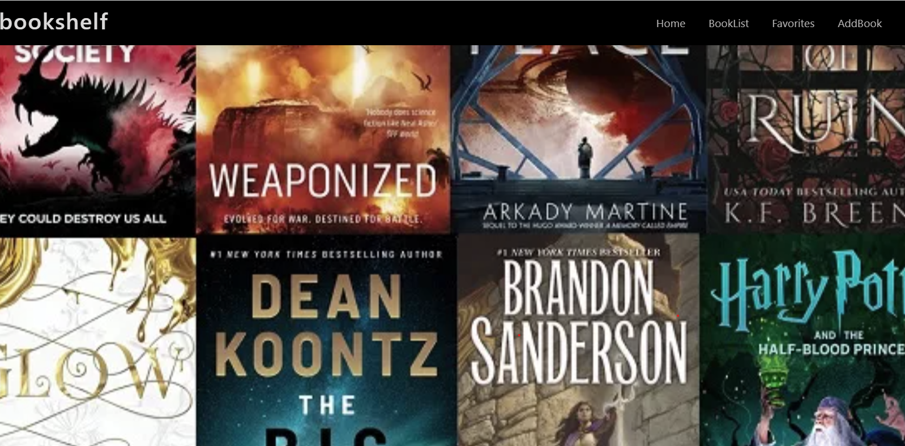

## Bookshelf App 

## By Jackline Chepngeno

### _bookshelf_ landing page

## Table of Content
- [Description](#description)
- [Features](#features)
- [Development](#development)
- [Setup Instructions and Technology](#technology-used)
- [License](#license)

## Description
_bookshelf_ is a web application meant to be help their clients in keeping upto date with major books that is meaningful to them. Its an inspiring, easy-to-use, intuitive app built to help enhance your reading, studying, and learning experience. Bookshelf offers industry leading, easy-to-use tools to help you learn more efficiently. With Bookshelf, you can read, highlight, and annotate just as you would on paper

This is a _bookshelf_ website with a front-end made using React and a backend made with Active records, Sinatra and Sqlite3. Active Record allowed us to create three models, _book_, _author_ and _category_ that could communicate with the tables, _books_, _authors_, _categories_ in the Sqlite3 database with the help of migrations that we created. In each model if where we defined our Active Record associations for example:
> Author  has_many :books
> Book belongs_to :author
    has_one :category, :foreign_key => 'category_id'
> Category  belongs_to :book
Sinata helped in creating api endpoints that could be used by React frontend to get, post, delete and update the products and its associates. Through the use of routing methods that Sinatra provided like **get**, **post**, **patch** and **delete** Active Record and Sinatra also provided methods that could be used to initiate a new instance of the classes, _Book_, _Author_ and _Category_ and be able to associate them.

## Features
---
A user visiting this page would be able to see:
1. A home page populated with books from different authors.
2. A top navigation section with links to booklist that allow a user to view all the books in our bookshelf
3. A top navigation section with links to favorite that allow a user to view all the books that are added to favorite and you can as well remove them from favourite
4. A top navigation section with links to addbook that allow a user to add a book he/she loves to the list of books available in our database 

### Technology Used
---
- Used Visual Studio Code editor to create the front-end with _**React**_ 
- **React** - help in creating interactive website
- HTML
- CSS
- Ruby
- Sinatra DSL

## Development

---

Want to contribute? Excellent!

To enhance or contribute on the existing project, follow these steps:

- Fork the repo
- Create a new branch (git checkout -b enhance-feature)
- Make the appropriate changes in the files
- Add changes to reflect the changes made
- Commit your changes (git commit -m 'Enhanced feature')
- Push to the branch (git push origin enhance-feature)
- Create a Pull Request

## License

---

MIT License

Copyright (c) [2022] [Jackline Chepngeno]

Permission is hereby granted, free of charge, to any person obtaining a copy
of this software and associated documentation files (the "Software"), to deal
in the Software without restriction, including without limitation the rights
to use, copy, modify, merge, publish, distribute, sublicense, and/or sell
copies of the Software, and to permit persons to whom the Software is
furnished to do so, subject to the following conditions:

The above copyright notice and this permission notice shall be included in all
copies or substantial portions of the Software.

THE SOFTWARE IS PROVIDED "AS IS", WITHOUT WARRANTY OF ANY KIND, EXPRESS OR
IMPLIED, INCLUDING BUT NOT LIMITED TO THE WARRANTIES OF MERCHANTABILITY,
FITNESS FOR A PARTICULAR PURPOSE AND NONINFRINGEMENT. IN NO EVENT SHALL THE
AUTHORS OR COPYRIGHT HOLDERS BE LIABLE FOR ANY CLAIM, DAMAGES OR OTHER
LIABILITY, WHETHER IN AN ACTION OF CONTRACT, TORT OR OTHERWISE, ARISING FROM,
OUT OF OR IN CONNECTION WITH THE SOFTWARE OR THE USE OR OTHER DEALINGS IN THE
SOFTWARE.